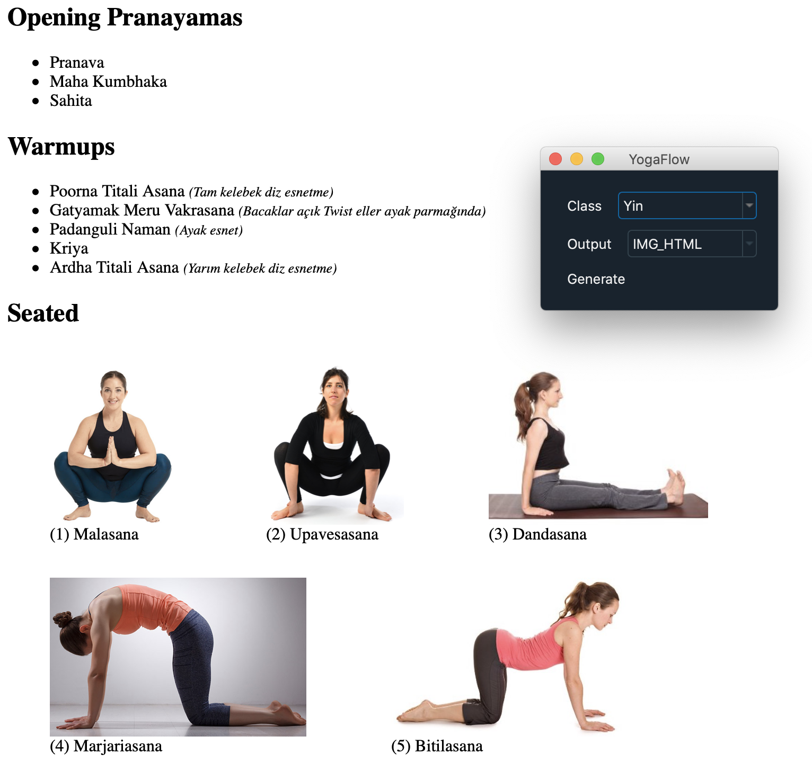

# YogaFlow

This is a random yoga flow generator, written in Python.



## Installation

### OS independent

* Install Python First. The program won't work unless you install Python.  [Click here](https://www.python.org/downloads/mac-osx/) to install Python. [The official Python docs](https://docs.python.org/3/using/mac.html) are good enough to help you through the installation.

* Create a folder (presumably called yogaflow), and download all of the files in this repository there

* Open a terminal window, go to the yogaflow folder and type the following commands:

```
python3 -m venv venv
```

### Windows

Install dependencies from the command line by typing:

```
cd yogaflow
venv\Scripts\activate.bat
pip install flask
pip install pywebview
```

### Mac

Install dependencies from the command line by typing:

```
cd yogaflow
. venv/bin/activate
pip install flask
pip install pywebview
```

## Customization

Edit config.json in your installation folder to change your paths and whatnot.

**DATA_DIR_PATH** should point to where you installed YogaFlow.

**DOWNLOAD_DIR** should point to a temporary folder where exported HTML files will be placed.

**SECTION_PERCENTAGE** can be altered to determine how long each section needs to be. Sum of those values should equal to 100.

**CUSTOM_BROWSER** is fully optional. If you leave it blank, your default browser will be used.

You probably won't need to change anything else.

## Usage

### Windows

Simply run main.py. You can run main.py from the command line by typing:

```
cd yogaflow
venv\Scripts\activate.bat
python3 main.py
```

Obviously, you should change the folder name yogaflow with your own installation path. Feel free to create a .bat file including this command for easy startup.

### Linux

Simply run main.py. You can run main.py from the command line by typing:

```
cd yogaflow
. venv/bin/activate
python3 main.py
```

Obviously, you should change the folder name yogaflow with your own installation path. Feel free to create a .sh file including this command for easy startup.

### Mac

You can follow instructions for Linux.

Additionally; you can create an AppleScript file via Script Editor so you can start YogaFlow with a simple click. Here is how the AppleScript command would look like:

```
do shell script "cd /Users/kerem/yogaflow; /Users/kerem/yogaflow/venv/bin/python /Users/kerem/yogaflow/main.py"
```

## Customization

You can customize content by editing the simple & intuitive JSON files under /data.